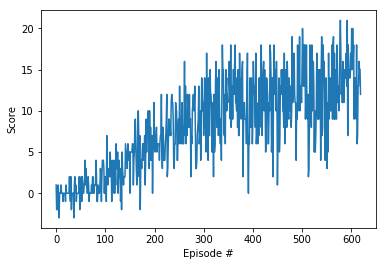
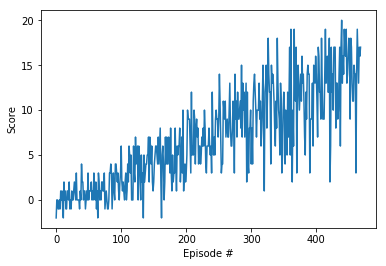

Report for Project 1: Navigation
=====================

A description of solution implementation.

## Learning Algorithm

*Deep Q-Network (DQN)* [[1]](https://storage.googleapis.com/deepmind-media/dqn/DQNNaturePaper.pdf) learning algorithm was used to train the agent (implemented in dqn_agent.py).
The agent class contains option for selecting *DoubleDQN* [[2]](https://arxiv.org/abs/1509.06461) algorithm variant (`use_double_dqn` constructor parameter).

### Hyperparameters used:
- `n_episodes = 2000` - max number of episodes during training
- `max_t = 1000` - max number of timesteps in an episode
- `eps_start = 1.0` - start value of e-greedy policy epsilon (1 is for full random policy)
- `eps_end = 0.01` - minimum value of e-greedy policy epsilon after epsilon decay
- `eps_decay = 0.995` - e-greedy policy epsilon decay rate (decay after each episode)
- `BUFFER_SIZE = 1e5` - size of replay buffer
- `BATCH_SIZE = 64` - minibatch size
- `GAMMA = 0.99` - TD discount factor
- `TAU = 1e-3` - for soft update of target parameters (to have fixed q-targets)
- `LR = 5e-4` - learning rate 
- `UPDATE_EVERY = 4` - how often to update the network

### Neural network architecture:
 - linear layer with 37 input features, 64 output features and bias
 - ReLU
 - linear layer with 64 input features, 64 output features and bias
 - ReLU
 - output linear layer with 64 input features, 4 output features and bias

 Trained model weights are stored in `trained_weights.pth` file.

## Plot of Rewards

The plot above illustrates that the agent was able able to receive an average reward (over 100 episodes) of at least +13 after the first 446 episodes.

The plot above illustrates that the agent was able able to receive an average reward (over 100 episodes) of at least +13 after the first 369 episodes.

## Ideas for Future Work

From plots above it is visible *DoubleDQN* variant has advantage of around 20% less episodes needed during training. Future work could further evaluate DQN improvements like Prioritized Experience Replay [[3]](https://arxiv.org/abs/1511.05952), Dueling DQN [[4]](https://arxiv.org/abs/1511.06581) or Rainbow [[5]](https://arxiv.org/abs/1710.02298) and optimize model size for compute time performance.